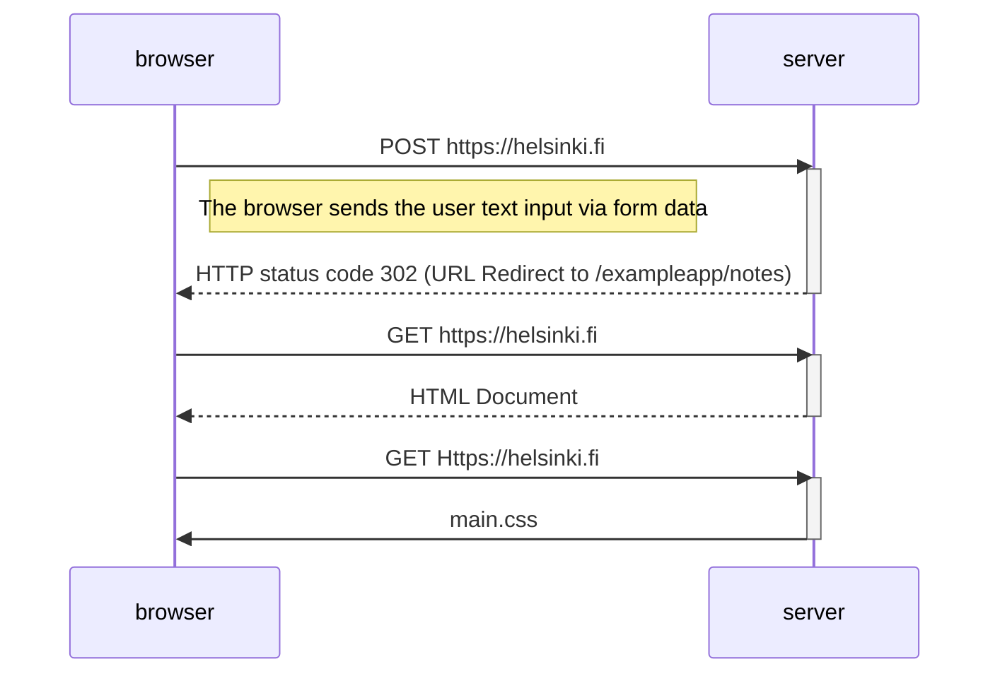

```mermaid
sequenceDiagram
  participant browser
  participant server

  %% 1. The User Submits a New Note
  browser->>server: POST https://helsinki.fi
  activate server
  note right of browser: The browser sends the user text input via form data
  server-->>browser: HTTP status code 302 (URL Redirect to /exampleapp/notes)
  deactivate server

  %% 2. Browser Reloads the Notes Page
  browser->>server: GET https://helsinki.fi
  activate server
  server-->>browser: HTML Document
  deactivate server

  %% 3. Browser Fetches The Stylesheet
  browser->>server: GET Https://helsinki.fi
  activate server
  server->>browser: main.css
  deactivate server
```
