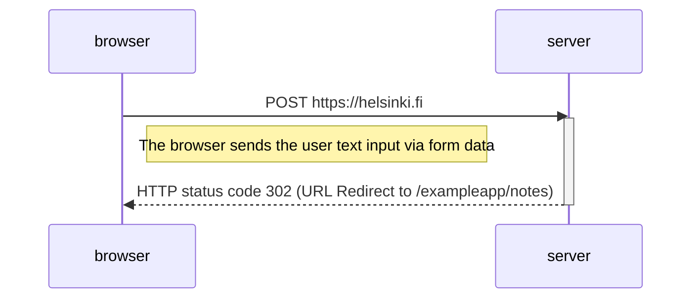

```mermaid
sequenceDiagram
  participant browser
  participant server

  %% 1. The User Submits a New Note
  browser->>server: POST https://helsinki.fi
  activate server
  note right of browser: The browser sends the user text input via form data
  server-->>browser: HTTP status code 302 (URL Redirect to /exampleapp/notes)
  deactivate server

  %%2. 
```
