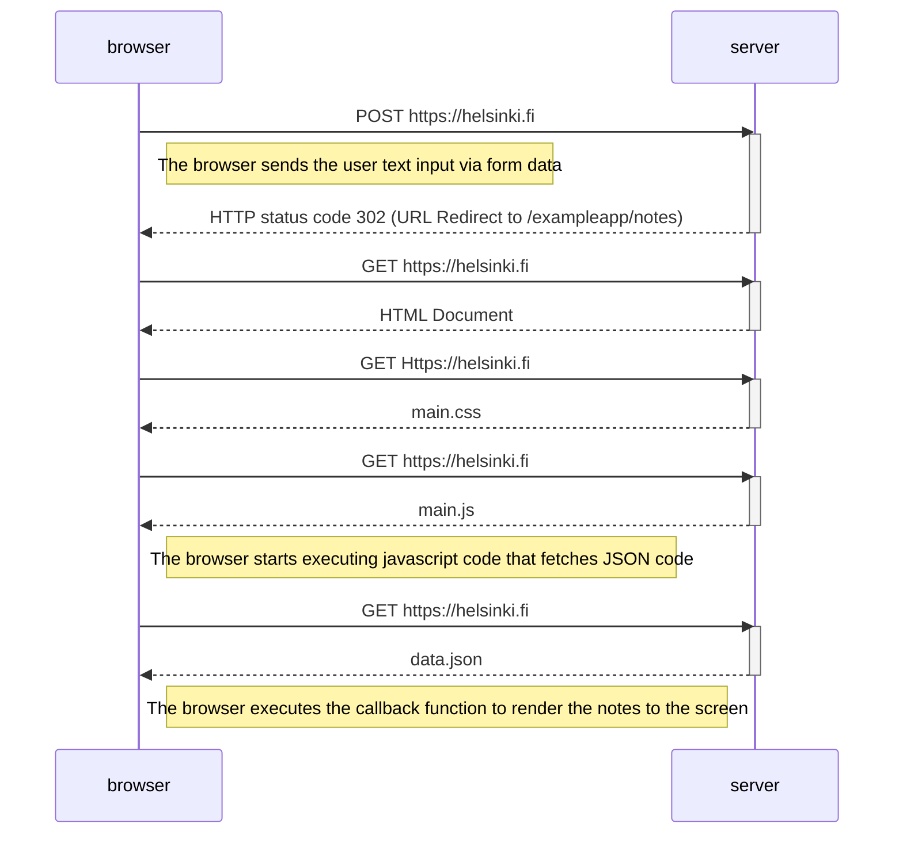

```mermaid
sequenceDiagram
  participant browser
  participant server

  browser->>server: POST https://helsinki.fi
  activate server
  Note right of browser: The browser sends the user text input via form data
  server-->>browser: HTTP status code 302 (URL Redirect to /exampleapp/notes)
  deactivate server

  browser->>server: GET https://helsinki.fi
  activate server
  server-->>browser: HTML Document
  deactivate server

  browser->>server: GET Https://helsinki.fi
  activate server
  server-->>browser: main.css
  deactivate server

  browser->>server: GET https://helsinki.fi
  activate server
  server-->>browser: main.js
  deactivate server

  Note right of browser: The browser starts executing javascript code that fetches JSON code

  browser->>server: GET https://helsinki.fi
  activate server
  server-->>browser: data.json
  deactivate server

  Note right of browser: The browser executes the callback function to render the notes to the screen
```
